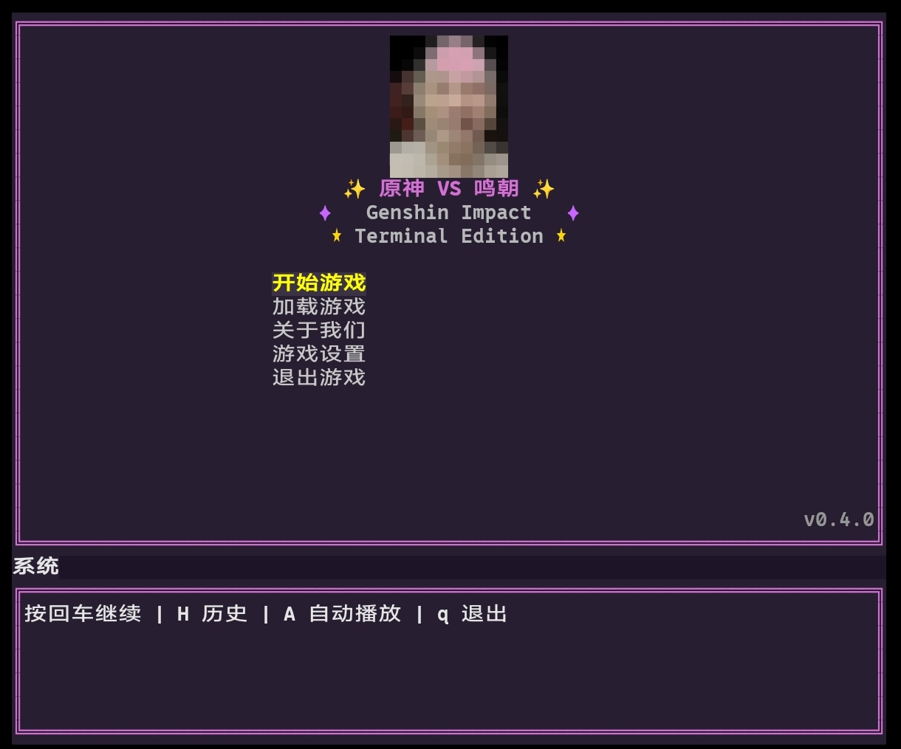

# 🎮 ngal - 终端视觉小说引擎

[](https://www.rust-lang.org/)
[](https://github.com/ratatui-org/ratatui)
[](LICENSE)

**ngal** 是一个用 Rust 编写的终端 Galgame（视觉小说）引擎，让你在命令行中体验分支对话的乐趣。

双边框 UI、**图片立绘**、**背景音乐**、**角色语音**、**选项分支**、**存档/读档**功能，并会自动创建项目所需的目录和默认剧情文件。

  

---

## ✨ 功能特色

- 🎨 **华丽彩色标题** – 主菜单显示渐变色艺术字，带星形装饰，支持自定义 Logo 图片
- 🖼️ **图片立绘** – 自动加载 `assets/portraits/` 目录下的角色图片，居中缩放显示，无图片时回退到 ASCII 占位
- 🎵 **背景音乐** – 支持场景内动态切换 BGM，音量可独立调节
- 🎤 **角色语音** – 每句台词可指定独立语音文件，支持自定义音量
- 📜 **极简剧情编写** – 支持 `说话人:文本:语音` 超简洁格式，无需编写 JSON 对象
- 💾 **存档/读档** – 随时按 `S` 保存，按 `L` 加载（存档保存在 `save/save.json`）
- 🕹️ **自动播放** – 可调节播放速度，解放双手自动推进对话
- 📜 **历史记录** – 按 `H` 查看最近对话，支持鼠标/键盘滚动
- ⚙️ **设置菜单** – 独立调节 BGM 和语音音量、自动播放开关及速度
- 🖱️ **鼠标支持** – 支持鼠标滚轮滚动菜单、鼠标点击选择选项
- 📝 **自定义底部提示** – 主菜单底部可显示自定义文本
- 🛠️ **自动初始化** – 首次运行自动创建所需目录和默认配置文件
- ⌨️ **简单操作** – 方向键/鼠标选择，回车/空格确认，ESC 返回，`q` 安全退出
- 🔒 **安全退出** – 无论正常退出、按 `q` 键、选择“退出”菜单还是意外 panic，终端均能恢复，不留控制字符
- 📦 **纯 Rust 实现** – 基于 `ratatui`、`crossterm` 和 `image` 库，轻量且跨平台

---

## 🚀 快速开始

### 安装

#### 从 crates.io 安装

```bash
cargo install ngal
```

#### 从源码编译

确保已安装 Rust（1.70+）：

```bash
git clone https://github.com/nasyt233/ngal.git
cd ngal
cargo build --release
```

编译后的可执行文件位于 target/release/ngal，可将其添加到 PATH。

### 运行

```bash
ngal
```

首次运行会在当前目录下创建以下结构：

```
.
├── assets/
│   ├── config.json           # 配置文件（自动生成）
│   ├── dialogue.json         # 默认剧情文件（自动生成）
│   ├── portraits/            # 角色立绘目录
│   │   ├── title.png         # 主菜单 Logo（可选）
│   │   └── 角色名.png        # 立绘图片（文件名需与 speaker 一致）
│   ├── music/                # 背景音乐目录
│   │   └── bgm.mp3           # 默认背景音乐（可选）
│   └── voices/               # 角色语音目录
│       └── 角色名.mp3        # 默认语音文件（可选）
├── save/
│   └── save.json             # 存档文件
└── ngal                      # 可执行程序
```

---

## 🎮 操作说明

键盘操作

- 空格/Enter 推进到下一句
- ↑/↓ 移动光标
- Enter 选择选项
- S/L 存档/读档 -ESC/q 退出程序
- A 切换自动播放
- H 历史回放

鼠标操作

- 滚轮：在主菜单上下滚动选择选项
- 左键点击：直接点击主菜单选项进入

---

## 📖 自定义剧情

所有剧情数据存储在 assets/dialogue.json 中。支持三种对话格式：

1. 极简格式（推荐）

```json
"说话人:文本"           # 无语音
"说话人:文本:语音文件"   # 有语音
"纯文本"                # 旁白（无说话人）
```

2. 完整格式（兼容旧版）

```json
{ "speaker": "角色A", "text": "文本", "voice": "语音.mp3" }
```

3. 音乐指令

```json
{ "music": "bgm.mp3" }
```

## 完整示例

```json
{
  "title": "你的游戏标题",
  "footer": "按回车继续 | q 返回主菜单 | H 历史 | A 自动播放",
  "scenes": {
    "start": {
      "dialogue": [
        { "music": "opening.mp3" },
        "旁白：故事开始了...",
        "主角：你好，世界！:greeting.mp3",
        "NPC：欢迎来到提瓦特大陆"
      ],
      "options": [
        { "text": "前往蒙德", "next_scene": "mond" },
        { "text": "前往璃月", "next_scene": "liyue" }
      ]
    },
    "mond": {
      "dialogue": [
        "温迪：呀吼！要听我唱歌吗？:venti_song.mp3",
        "主角：好啊"
      ],
      "options": []
    }
  },
  "initial_scene": "start"
}
```

## 字段说明

- title：主菜单标题（支持 emoji）
- footer：底部提示文字
- scenes：场景字典
- dialogue：对话数组，支持上述所有格式
- options：选项列表（可为空）
- initial_scene：起始场景 ID

---

## 🎵 音频支持

### 背景音乐

- 文件放入 assets/music/
- 使用 { "music": "文件名.mp3" } 切换
- 音量在设置菜单调节（0-100）

### 角色语音

- 文件放入 assets/voices/
- 极简格式：说话人:文本:文件名.mp3
- 默认文件名：{说话人}.mp3
- 音量独立调节

### 播放器要求

- 需安装 mpv 播放器
  - Termux: pkg install mpv
  - Linux: sudo apt install mpv
  - Windows: 下载安装并添加到 PATH

---

## ⚙️ 配置文件

assets/config.json 自动生成：

```json
{
  "bgm_volume": 70,
  "voice_volume": 80,
  "auto_play": false,
  "auto_play_speed": 2.0,
  "version": "0.4.0"
}
```

- bgm_volume：背景音乐音量
- voice_volume：语音音量
- auto_play：自动播放开关
- auto_play_speed：自动播放速度（秒）
- version：版本号

---

## 💾 存档机制

- 存档位置：save/save.json
- 保存内容：当前场景、对话索引、菜单选项
- 快捷键：S 存档，L 读档
- 读档后自动恢复对话和语音

---

## 🎨 立绘与 Logo

- 角色立绘：放入 assets/portraits/角色名.png，自动显示
- 主菜单 Logo：放入 assets/portraits/title.png，自动显示在标题上方
- 支持 PNG、JPEG、WebP 等格式，自动缩放居中

---

## 📜 历史记录

- 按 H 打开历史记录窗口
- 显示最近 50 条对话
- 支持鼠标滚轮滚动
- 最新对话显示在底部

---

## 🤝 贡献

欢迎提交 Issue 和 Pull Request！

```bash
cargo build
cargo run
cargo fmt
cargo clippy
```

---

## 📄 许可证

MIT License

---

## 🙏 致谢

- Ratatui – 终端 UI 框架
- Crossterm – 跨平台终端处理
- image – 图片解码与缩放
- mpv – 音频播放器

---

现在就开始你的终端冒险吧！ 🎉

```
