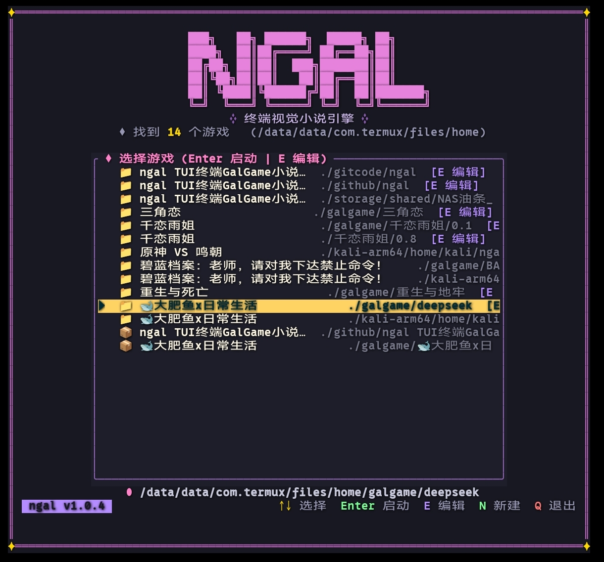
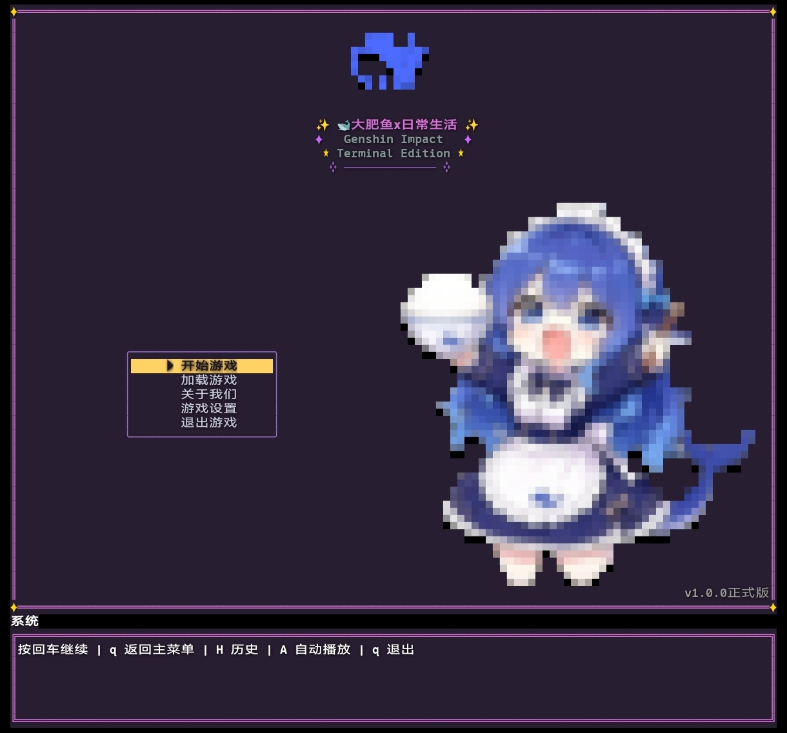
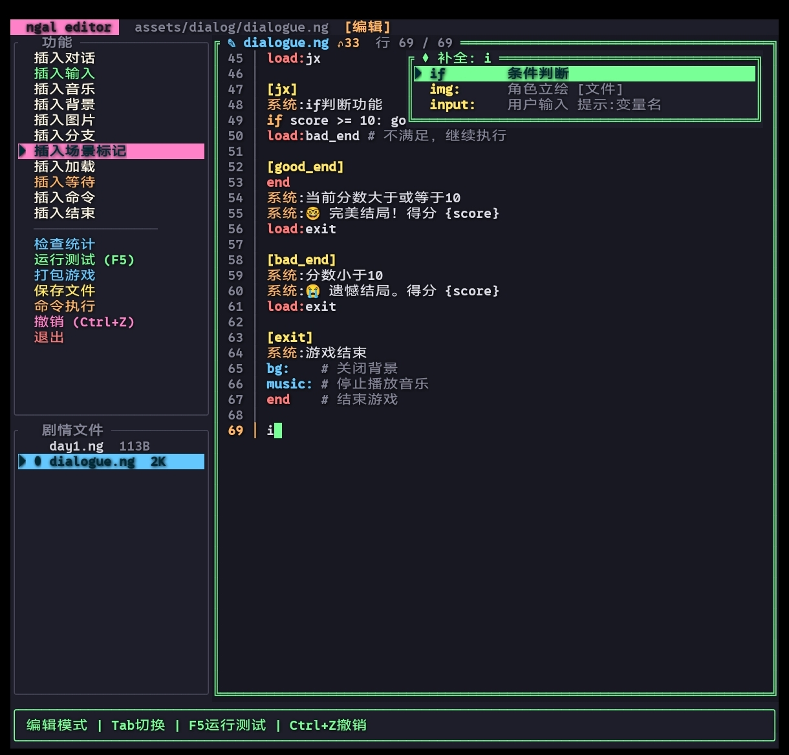

# 🎮 ngal - 终端视觉小说引擎

运行界面

游戏界面

编辑器界面


[English README](README_en.md)


> 一个用 Rust 编写的终端 Galgame 引擎，让你在命令行里享受视觉小说。

## ✨ 特性
- 🤓 自动扫描，游戏
- 🎨 彩色界面，双线边框布局
- 📝 自带编辑器，简单友好方便
- 🖼️ 角色立绘 & 背景图片（支持 PNG/JPEG）
- 🎵 背景音乐 & 角色语音（需 mpv）
- 📜 分支选项 & 多结局
- 💾 无限延伸存档位
- ⌨️ 自动播放、文字动画、历史记录
- 🎨 可调背景色选择
- 🧮 变量运算（`+ - * /`）与 `if` 条件判断
- 📝 行内注释（`#`）与转义字符（`:` `"` `'` `\n` `\t`）
- 🕹 命令执行 $(uptime) 能执行系统命令进行获取公告什么的

## 🚀 快速开始

### 安装

#### linux或termux 一键安装脚本
```bash
bash -c "$(curl -L https://raw.gitcode.com/nasyt/ngal/raw/main/install.sh)"
```

#### 源码编译
```bash
git clone https://github.com/nasyt233/ngal.git
cd ngal
cargo build --release
```

#### crates.io 安装
```bash
cargo install ngal
```

### 运行
```bash
ngal              # 运行当前目录下的游戏
ngal mygame       # 运行指定目录下的游戏
ngal --version    # 查看版本信息
ngal build        # 打包游戏
ngal edit         # 内容编辑器
```

### 目录结构
首次启动会自动创建以下目录：
```
assets/
├── game.json       # 游戏配置文件
├── dialog/
│   ├── dialogue.ng # 脚本文件
│   └── xxx.ng      # 其他脚本文件
├── portraits/      # 角色立绘
├── music/          # 背景音乐
└── voices/         # 角色语音
save/               # 存档目录
```

## 📖 脚本编写

主脚本文件为 `assets/dialog/dialogue.ng`，支持 `.ng` 与 `.txt` 两种扩展名。

### 基础语法
```ng
# ngal v1.0.4示例教学默认剧情    # 符号为注释

[welcome]               # [welcome]为剧情入口
第一章                   # 没角色名直接显示文字
load:index              # 加载其他子剧情，支持同目录下其他剧情文件(load:day1.ng:welcome)

[index]                 # 子剧情中间不能有空行，否则断开
name = 嘉豪              # 变量设置
bg:bg.png               # 加载背景图
系统:等待2秒
sleep:2                 # 等待2秒过程无法操作,完成后自动执行下条命令。
系统:2秒等待结束。
music:bg.mp3            # 加载音乐
img:logo.png:2:50%      # 加载立绘(位置有123可选分别对应左中右,50%指的比例大小)
系统:欢迎来到 ngal 引擎！   # 带角色名显示文字
系统:你好用户:hello.mp3    # 带语音播放显示文字
系统:当前时间 $(date)      # $()命令执行功能默认使用sh
系统:当前用户 $(whoami)\n当前目录 $(pwd)    # \n文字换行功能
系统:来自于$(curl -s myip.ipip.net | grep -oE " 来自于.*" | sed s/来自于//)
img:logo2.png           # 可以切换立绘(音乐,背景同理)
img:                    # 留空则关闭立绘(音乐,背景同理)
系统:当前默认名字：{name}   # {}调用变量，在变量运算中可以不用{}
input:请输入你的名字:name   # 读取用户输入变量
{name}:我的名字是：{name}！ # 变量也可以用于当角色名
变量运算
a = 13
系统:a的值为{a}
b = 78
系统:b的值为{b}
c = a + b               # 变量运算支持(+, -, *, /)
系统:相加计算结果为 {c}
系统:下面是选项选择
score = 10
系统:当前分数为{score}     # 分支选择剧情每个选项用|分开
choose:接受冒险(分数+8):accept|拒绝冒险(分数-5):refuse

[accept]
系统:你接受了冒险！
score = score + 8
系统:当前分数 {score}
load:jx

[refuse]
系统:你拒绝了冒险！
score = score - 5
系统:当前分数 {score}
load:jx

[jx]
系统:if判断功能
if score >= 10: good_end # 满足要求跳转
load:bad_end # 不满足，继续执行

[good_end]
end
系统:当前分数大于或等于10
系统:🤓 完美结局！得分 {score}
load:exit

[bad_end]
系统:分数小于10
系统:😭 遗憾结局。得分 {score}
load:exit

[exit]
系统:游戏结束
bg:    # 关闭背景
music: # 停止播放音乐
end    # 结束游戏
```

### 指令参考

| 指令 | 格式 | 说明 |
|---|---|---|
| 对话 | `角色名:文本` | 显示角色对话 |
| 带语音对话 | `角色名:文本:语音.mp3` | 语音文件放 `assets/voices/` |
| 旁白 | `文本内容` | 无角色名的文本 |
| 变量赋值 | `变量 = 值` | 支持字符串与数字 |
| 变量运算 | `变量 = 表达式` | 支持 `+ - * /` 及括号 |
| 用户输入 | `input:提示:变量` | 读取用户输入到变量 |
| 变量插入 | `{变量}` | 在文本中插入变量值 |
| 立绘 | `img:文件.png:位置:缩放%` | 位置：1-左，2-中，3-右 |
| 清除立绘 | `img:` | 留空即移除立绘 |
| 背景图片 | `bg:文件.png` | 拉伸铺满屏幕 |
| 停止等待 | `sleep:0.5` | 等待0.5秒 |
| 清除背景 | `bg:` | 留空即清除背景 |
| 背景音乐 | `music:文件.mp3` | 放于 `assets/music/` |
| 停止音乐 | `music:` | 留空即停止播放 |
| 分支选择 | `choose:选项1:场景1\|选项2:场景2` | 用竖线分隔选项 |
| 条件跳转 | `if 条件:场景` | 支持 `> < >= <= == !=` |
| 场景跳转 | `load:场景` | 跳转到指定场景 |
| 外部场景跳转 | `load:文件.ng:场景` | 加载外部脚本并跳转 |
| 退出游戏 | `end` | 返回主菜单 |

### ⌨️ 按键绑定

| 按键 | 功能 |
|---|---|
| 空格 / 回车 | 推进对话 / 确认选项 |
| ↑ / ↓ | 选择选项 / 滚动列表 |
| ESC | 返回 / 退出菜单 |
| S | 保存游戏 |
| L | 读取存档 |
| H | 显示历史记录 |
| A | 切换自动播放 |
| T | 切换打字机动画 |
| 3 / 4 | 调整文字速度 |
| B | 循环切换背景色 |
| q | 返回菜单 / 退出 |

编辑器按键
在编辑器界面输入h查看

## 📜 依赖
- **mpv** — 播放音频必需
- Rust 1.70+

## 📄 许可证
MIT
